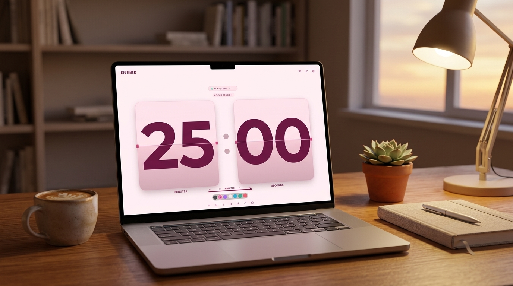
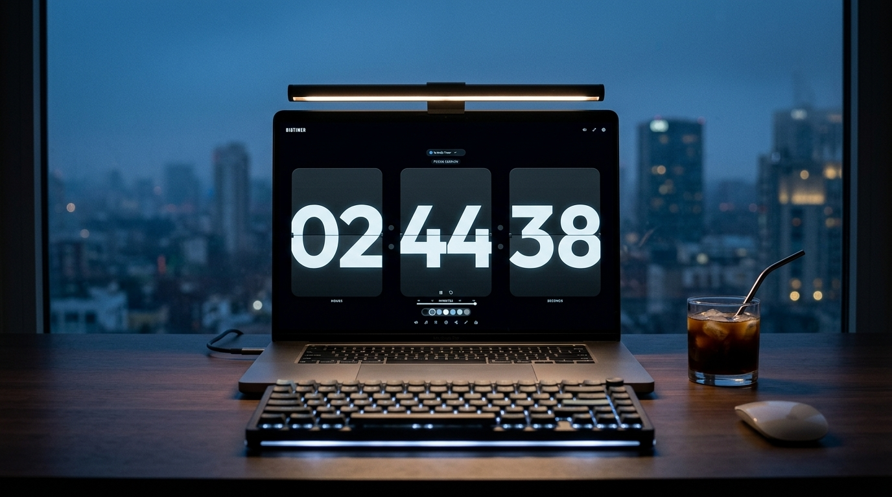

# Aesthetic Timer ⏳

<div align="center">

[](https://opensource.org/licenses/MIT)
[](https://www.typescriptlang.org/)
[](https://reactjs.org/)
[](https://tailwindcss.com/)
[](https://vitejs.dev/)

**A vintage mechanical split-flap desk clock, Pomodoro focus suite, and aesthetic countdown timer.**

[Live Demo](#-why-aesthetic-timer) • [Features](#-key-features) • [Showcase](#-showcase-gallery) • [Tech Stack](#-tech-stack) • [Getting Started](#-getting-started)

<br/>



</div>

---

## 🌟 Why Aesthetic Timer?

Most online timers are cluttered with ads, poorly designed, or look like alarm clocks from 2010. **Aesthetic Timer** was engineered as a high-craft workspace companion—bringing the tactile, satisfying sensation of retro Solari split-flap departure boards right to your desktop, iPad, or smartphone.

Built in **1 hour** with AI pair-programming, this application combines 60fps mechanical physics, high-contrast aesthetic palettes, and a zero-latency Web Audio sound engine into a distraction-free deep work tool.

---

## 📸 Showcase Gallery

<div align="center">

| ☀️ Cozy Daylight Setup (Blush Pink Theme) | 🌙 Midnight Focus Setup (Dark Mode) |
| :---: | :---: |
|  |  |

</div>

---

## ✨ Key Features

### 1. 🕰️ Glitch-Free 3D Split-Flap Animation Engine
- Authentic mechanical flipping with a two-phase CSS 3D transform pipeline (`foldUpper` and `dropLower`).
- Dynamic lighting overlays: upper shadow fade-in and lower highlight dissipation.
- Central razor-thin seam line divider with lateral mechanical hinge pins.

### 2. 🎨 7 Calibrated Aesthetic Color Themes
- **Midnight Black** — Pure deep charcoal with crisp white digits (`16.2:1 AAA`).
- **Baby Pink** — Soft blush rose with rich blackberry plum contrast (`12.5:1 AAA`).
- **Warm Cream** — Linen sand with dark espresso numerals (`14.2:1 AAA`).
- **Lavender Dream** — Violet night with radiant orchid text (`14.0:1 AAA`).
- **Cyber Cyan** — Ocean abyss with neon sky blue glow (`15.1:1 AAA`).
- **Matcha Sage** — Forest moss with vibrant emerald numerals (`15.3:1 AAA`).
- **Sunset Crimson** — Wine charcoal with soft peach blossom digits (`15.0:1 AAA`).

### 3. 📱 Dual View Orientation (Horizontal ↔ Vertical)
- **Horizontal (Side-by-Side)**: Standard row layout optimized for laptops, desktops, and landscape tablet stands.
- **Vertical (Stacked Cards)**: Flaps stack vertically (`[HH]` over `[MM]` over `[SS]`), allowing digits to scale up to **80vw wide** on portrait mobile devices without squishing.
- Toggle anytime via the `Smartphone` icon or the **`V`** keyboard shortcut.

### 4. ✍️ Natural Language Duration Parsing
- Dial any exact custom timer effortlessly:
  - Phrased: `"2 hours 45 minutes"`, `"two hours 45 mins"`, `"1 hr 30 min"`
  - Shorthand: `"2h 45m"`, `"90s"`, `"165m"`
  - Digital time: `"02:45:00"`, `"1:30"`
  - URL Query: `?t=2h45m` or `?t=25m`

### 5. 🎧 Ambient Lo-Fi Soundscapes
- Built with zero-latency Web Audio API:
  - 🌧️ Rain Sounds
  - 🌊 Ocean Waves
  - ☕ Coffee Shop Murmur
  - 📻 Analog Vinyl & White/Pink/Brown Noise
  - ⏱️ Mechanical Ticking

### 6. 🛠️ Complete Focus Suite
- **Countdown Timer**: 3-card auto-stabilizing layout for multi-hour timers.
- **Pomodoro Mode**: 25m focus / 5m short break / 15m long break cycles with session dots.
- **Stopwatch**: Precise split timing down to the millisecond with lap recording.
- **Live Flip Clock**: Real-time 12H/24H desktop clock with AM/PM indicator.

---

## ⌨️ Keyboard Shortcuts

| Key | Action |
| :---: | :--- |
| **`Space`** | Start / Pause timer |
| **`R`** | Reset timer to original duration |
| **`F`** | Toggle Fullscreen mode |
| **`M`** | Mute / Unmute all sounds |
| **`V`** | Toggle Horizontal ↔ Vertical Orientation |
| **`1`** | Switch to Countdown Timer |
| **`2`** | Switch to Pomodoro Mode |
| **`3`** | Switch to Stopwatch |
| **`4`** | Switch to Live Flip Clock |

---

## 🚀 Tech Stack

- **Framework**: [React 18](https://reactjs.org/)
- **Language**: [TypeScript](https://www.typescriptlang.org/)
- **Styling**: [Tailwind CSS](https://tailwindcss.com/) + Custom CSS 3D Transforms
- **Icons**: [Lucide React](https://lucide.dev/)
- **Audio**: Web Audio API (synthetic ambient noise generators + mechanical click synthesizer)
- **Bundler & Tooling**: [Vite](https://vitejs.dev/) + [Vitest](https://vitest.dev/)
- **Deployment**: [Netlify](https://netlify.com/)

---

## 💻 Getting Started

### Prerequisites
- Node.js (v18 or newer recommended)
- npm or yarn

### Installation

1. **Clone the repository:**
   ```bash
   git clone https://github.com/sujeetkumar22/aesthetic-timer.git
   cd aesthetic-timer
   ```

2. **Install dependencies:**
   ```bash
   npm install
   ```

3. **Start the development server:**
   ```bash
   npm run dev
   ```
   Open [http://localhost:3000](http://localhost:3000) in your browser.

4. **Run unit tests:**
   ```bash
   npm test
   ```

5. **Build for production:**
   ```bash
   npm run build
   ```

---

## 📄 License

This project is open source and available under the [MIT License](LICENSE).

---

<div align="center">

Crafted with care by [Sujeet Kumar](https://github.com/sujeetkumar22) • Powered by modern web technology & AI.

</div>
